# Development Log

The development log captures key moments in your application development:

- **Design ideas / notes** for features, UI, etc.
- **Key features** completed and working
- **Interesting bugs** and how you overcame them
- **Significant changes** to your design
- Etc.

---

## Date: 20/03/2026

Found location images and setup initial location image.

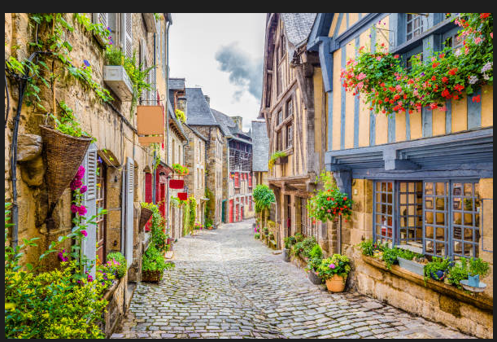

---

## Date: 23/03/2026

Added Healthbars and improved location system

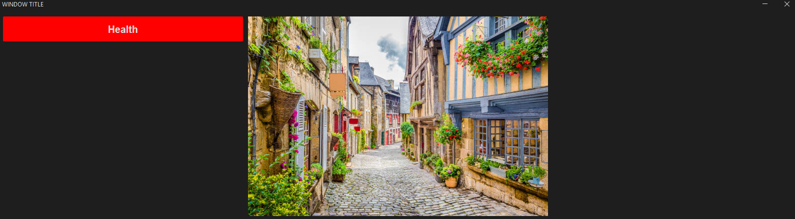

---

## Date: 25/03/2026

Setup Travel System and added/updated locations.

New/Updated:
Beach
Desert
Forest
Strange Land
Meadow
Mountains
Snow Forest
Village

---

## Date: 27/03/2026

Added enemy spawning when travelling to a new location.

Leo:
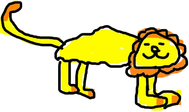

---

## Date: 1/04/2026

Card windows and drag and drop system implemented

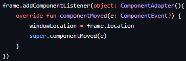

---

## Date: 22/04/2026

Finished Turn System:

Fight/Flee ->
Player turn ->
Enemy regular attack ->
Enemy special attack? ->
Repeat

---

## Date: 24/04/2026

Game log finished and now scrollable.

text area is inside the log area scroll pane to allow scrolling

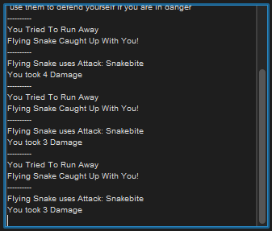

---

## Date: 29/04/2026

Lose and Enemy Defeat states added, now player can move past fight 1.

---

## Date: 4/06/2026

Completely Renovated UI
& Finished Card UI

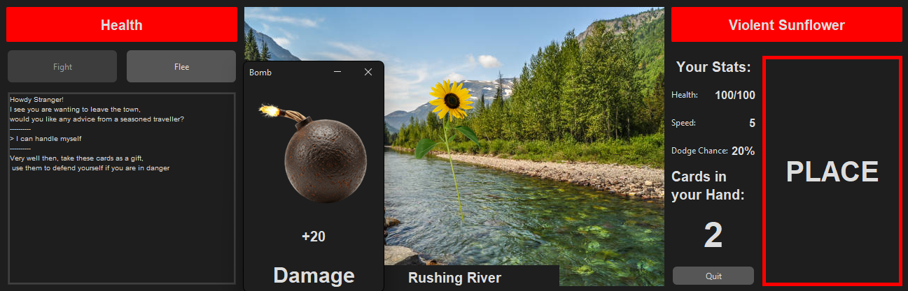 (Later image)

---

## Date: 6/05/2026

Added Card images, and missing enemies

Final list of enemies:

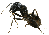

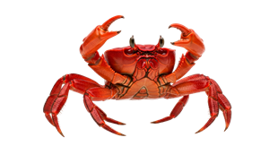
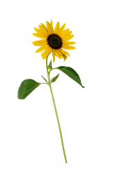
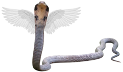

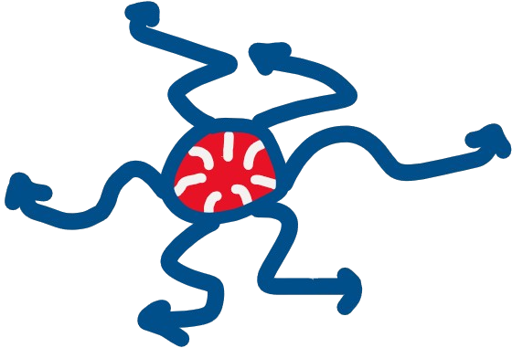

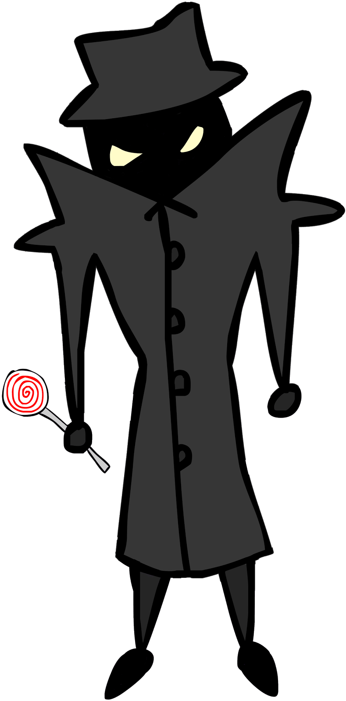
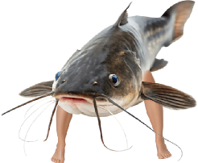
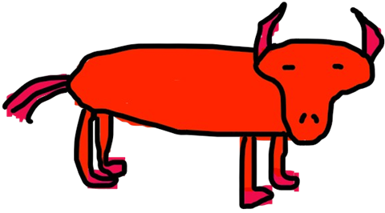

List of cards:

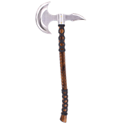
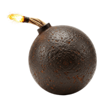
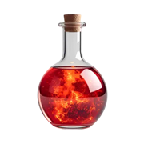
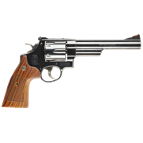
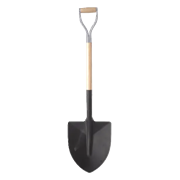
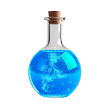
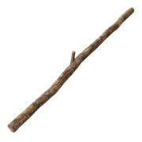
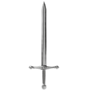
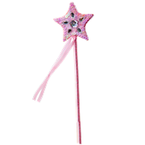