# Results of Testing

The test results show the actual outcome of the testing, following the [Test Plan](test-plan.md)

---

## Game Map

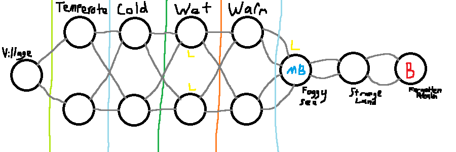

---

## Map and Deck setup - GAMEPLAY

Testing that the map is generated correctly and the Card Decks are organised and generated correctly.

### Test Data Used

Printed output of map after generation,
Printed output of normalDeck after generation,
Printed output of legendaryDeck after generation,

### Test Result

**Map Setup**

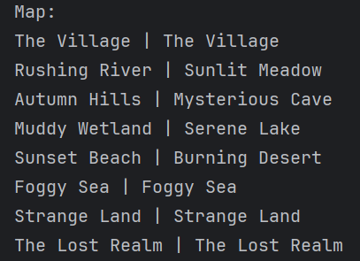

Matches the original Map Idea:

**Deck Setup**

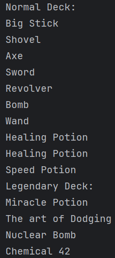

Correctly contains every card (Healing potion appears twice to make it more common).

---

## Tutorial Scroll - VALID, BOUNDARY, INVALID

Testing to make sure the tutorial works correctly and the buttons function as they should during the tutorial.

### Test Data Used

Valid/Boundary test, testing using the tutorial as expected.

Invalid test, attempting to move out of bounds of the tutorial text list.

### Test Result

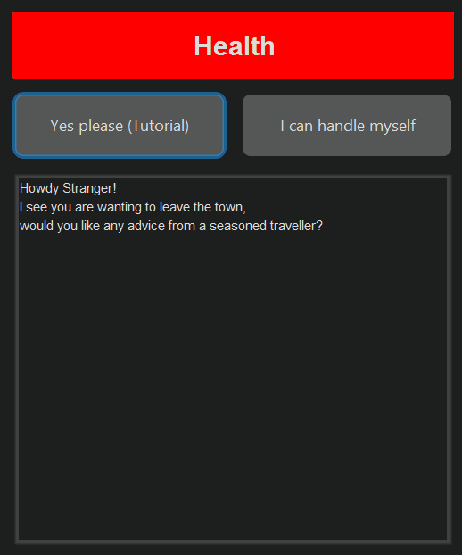

The test showed that the player cannot go back beyond the first text section and the tutorial works correctly within the
boundaries, it also shows that the tutorial will end when the next is clicked on the final text section.

---

## Travelling - GAMEPLAY

Testing that when the player is given the option to travel, they are transported to the new location correctly.

### Test Data Used

Gameplay of travelling x2

### Test Result

**Test 1**
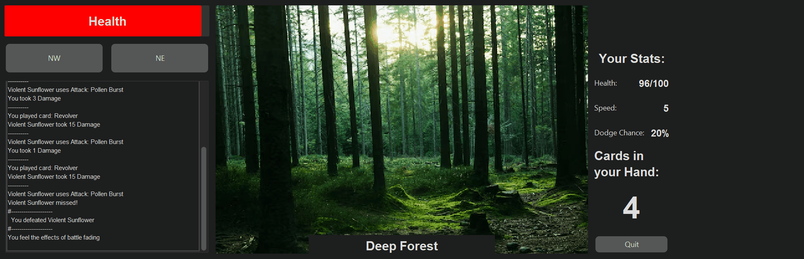

**Test 2**
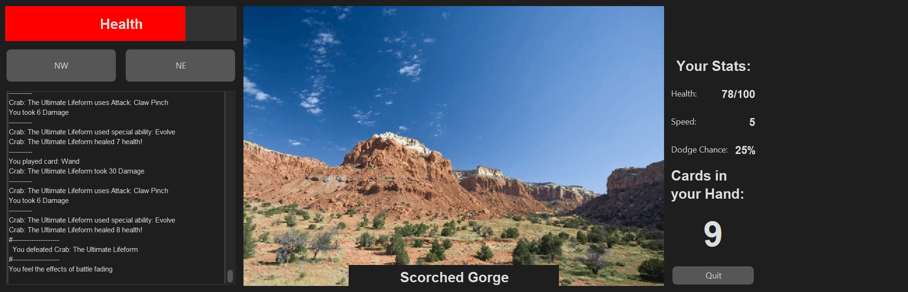

Travelling works correctly and the enemy appears as intended when travelling to a variable location (Test 1) or a
guaranteed location (Test 2).

---

## Fight Option - VALID, INVALID

Testing that the fight button works correctly.

### Test Data Used

Testing of the fight button before (Valid) and during (Invalid) a fight

### Test Result

**Initial Test**
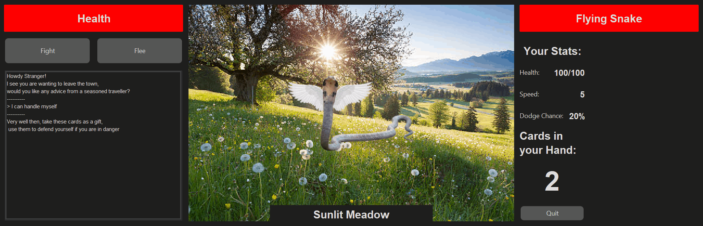

When I clicked the fight button, nothing occured, this was because the handler was missing the correct game state
update. I fixed this by updating the game state to PLAYER_TURN when the button is clicked.

**Second Test**
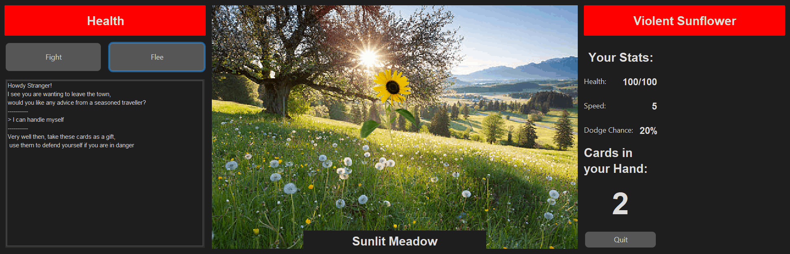

This test succeeded as the game state changed and the card placement area appeared, this also locks the fight button as
intended because the player is already in combat.

---

## Flee Option - GAMEPLAY, VALID, INVALID

Testing of the flee option and ensuring it works correctly.

### Test Data Used

Testing of fleeing before and during a fight.
Also testing of flee success and flee failure.

### Test Result

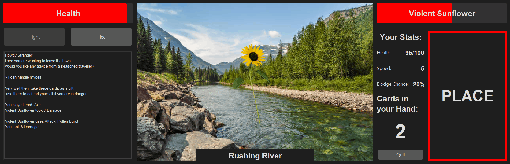

When I tested the flee function, it mostly worked as intended, however I found that the button was not disabled until
the enemy turn timer had ended, therefore it gave a one-second window where flee could be clicked again, and it would
restart the process (Invalid Input).

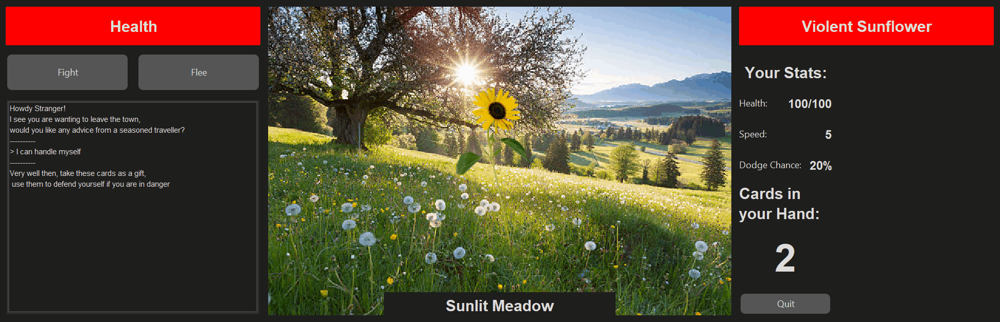

I fixed this by updating the game state when the button was clicked instead of having to wait for the timer to pass
which prevented spam clicking, other than that the flee works correctly. (I fixed the Log inconsistency later)

---

## Card-Main Window Interaction - UI, GAMEPLAY, VALID, BOUNDARY, INVALID

Testing card placement and detection.

### Test Data Used

Playing cards during combat,
Attempting to play cards outside of combat.

### Test Result

**Valid/Boundary Testing**
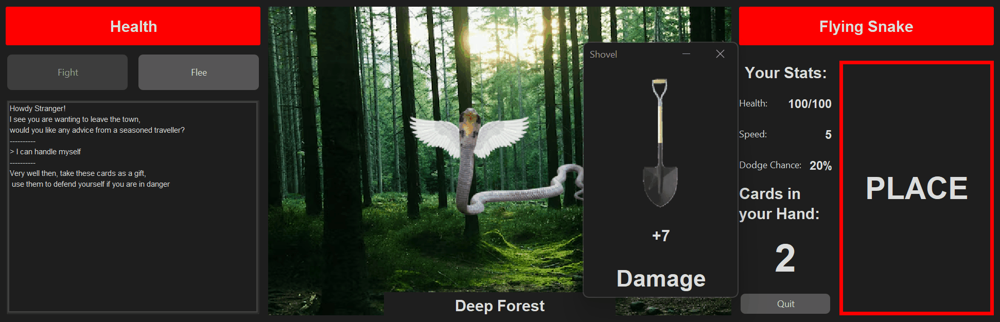

The card is detected correctly within a small tolerance around the card area for ease of use. As intended.

**Invalid Testing**
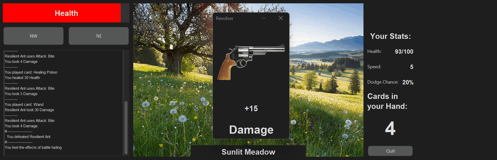

The card correctly is never detected when outside of combat to prevent errors.

(Card will be detected before fight has been clicked as a QOL feature rather than clicking fight every round.)

All is working as expected.

---

## Card Placed - Gameplay

Testing that when the Card placement is detected the cards effect is run correctly.

### Test Data Used

Playing a card during combat.

### Test Result

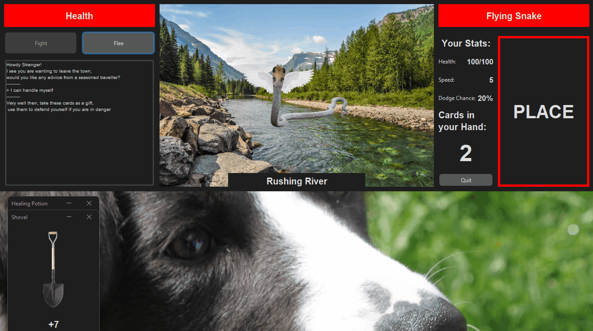

The card effect is correctly activated and the card is then moved down below the screen, this is working exactly as
expected.

---

## Card Window UI Updates - UI, GAMEPLAY

Testing that the Card Window UI and function is Updated whenever the card is dropped or redrawn.

### Test Data Used

The Card Window UI before the card is played,
The Card Window UI after the card is played.

### Test Result

**Before the card is played:**

**After the card is played:**

The title, amount and effect all change but the image does not change.

Fixed by adding a .icon update to the CardWindow updateUI.

**Testing Card functionality:**

The card is updated and its functionality changes which is working as expected, however the card reappears at an
inconvenient location, which I changed (See Above Test).

---

## Enemy Turn - Gameplay

Testing that the enemies turn plays out as intended.

### Test Data Used

Multiple rounds of combat gameplay.

### Test Result

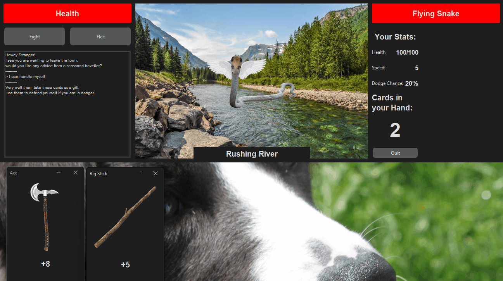

Simple enemies work correctly, attempting to attack once and then if they hit dealing damage.

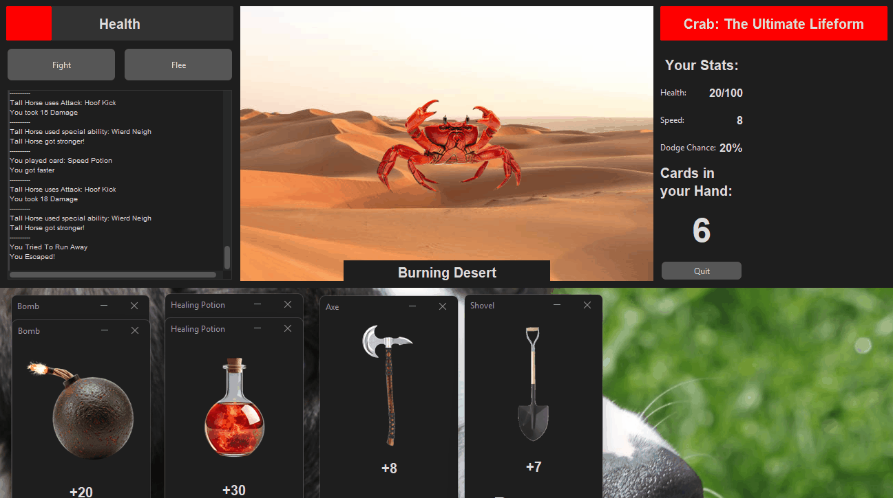

Complex enemies do not correctly, attempting to attack but if they miss, they will not attempt their special ability,
and will only use their special ability if they hit their first attack. This is not intended and is fixed by un-nesting
the statement that makes the special ability rely on the first attack.

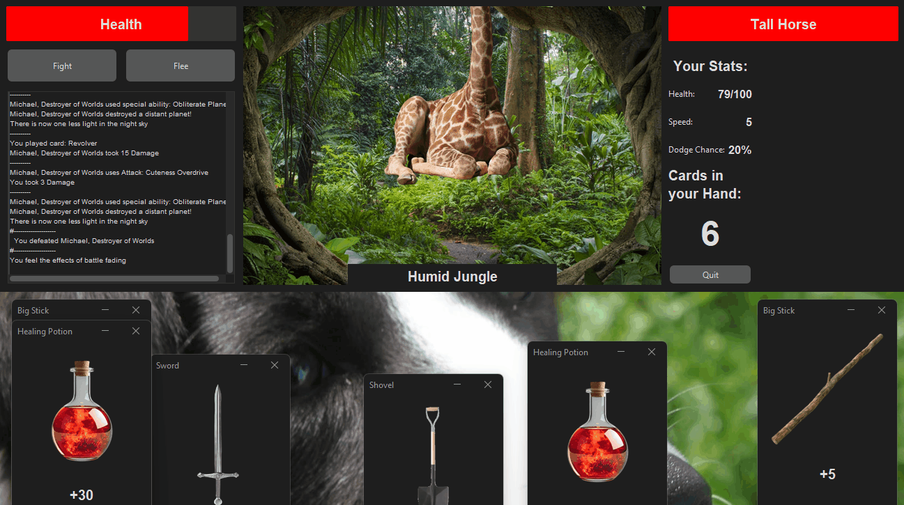

All now works as intended.

---

## BattleEnd/Lose/Win Detection - GAMEPLAY

Detection for the battle end, win and lose states.

### Test Data Used

Defeating an enemy during gameplay.
Reaching the win and lose conditions during gameplay.

### Test Result

**Enemy Defeat Condition**
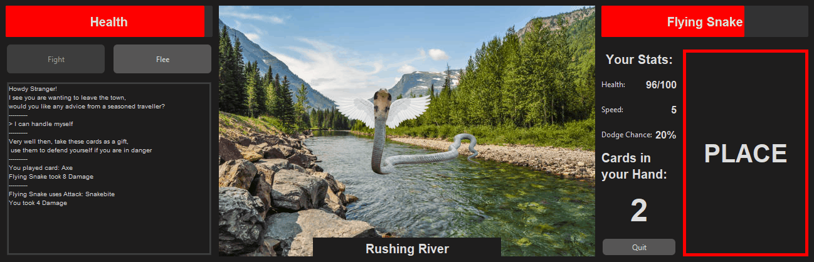

**Loss Condition**     
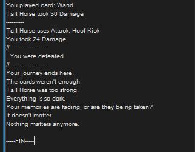

**Win Condition**      
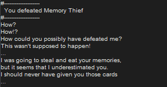

All work as expected.

---

## Health Limits - VALID, BOUNDARY, INVALID

Testing Player and Enemy health limits.

### Test Data Used

Player using a healing card that would increase health beyond maximum.
Enemy healing ability that would increase its health beyond maximum.

### Test Result

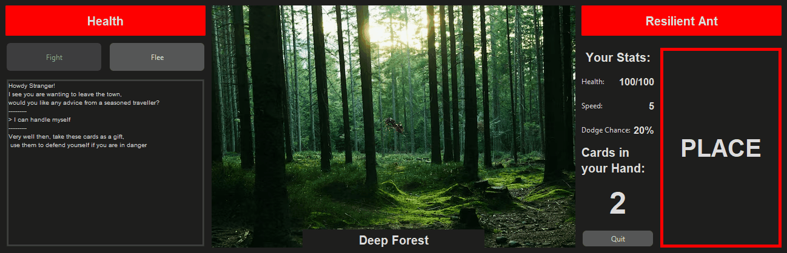

Player health is clamped at maximum when using a healing card.

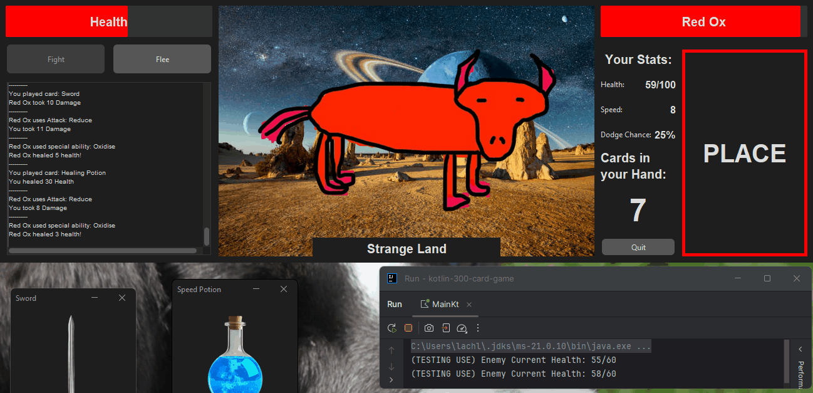

Enemy health is not limited when using a healing ability.
This is fixed by adding the line:

if (enemy.health > enemy.maxHealth) enemy.health = enemy.maxHealth

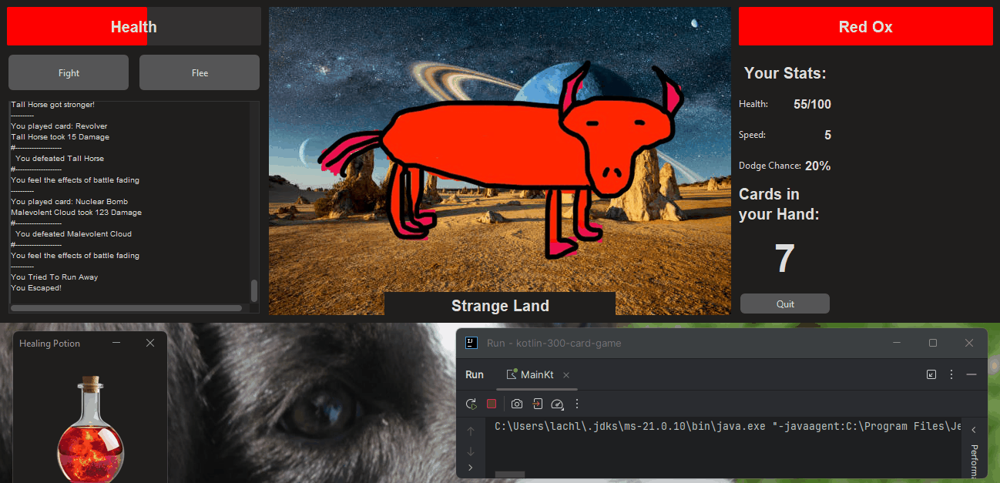

All now works as expected.

---