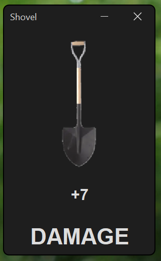
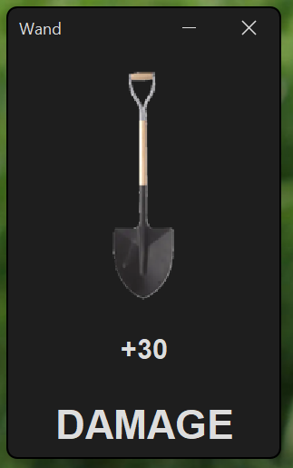
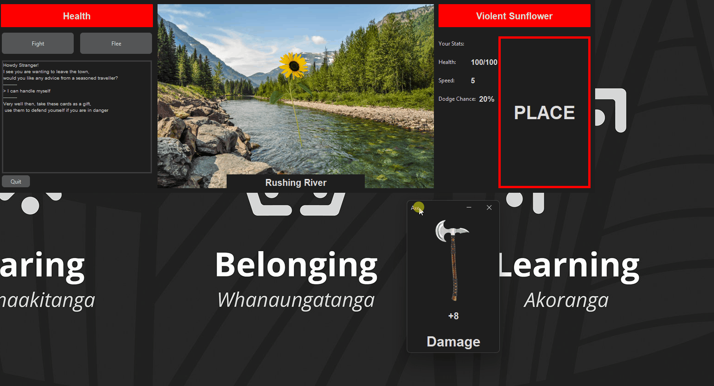

# Results of Testing

The test results show the actual outcome of the testing, following the [Test Plan](test-plan.md)

---

## Map Setup - GAMEPLAY

Example test description. Example test description.Example test description. Example test description.Example test
description. Example test description.

### Test Data Used

Details of test data. Details of test data. Details of test data. Details of test data. Details of test data. Details of
test data. Details of test data.

### Test Result

Comment on test result. Comment on test result. Comment on test result. Comment on test result. Comment on test result.
Comment on test result.

---

## Tutorial Scroll - VALID, BOUNDARY, INVALID

Example test description. Example test description.Example test description. Example test description.Example test
description. Example test description.

### Test Data Used

Details of test data. Details of test data. Details of test data. Details of test data. Details of test data. Details of
test data. Details of test data.

### Test Result

Comment on test result. Comment on test result. Comment on test result. Comment on test result. Comment on test result.
Comment on test result.

---

## Travelling - GAMEPLAY

Example test description. Example test description.Example test description. Example test description.Example test
description. Example test description.

### Test Data Used

Details of test data. Details of test data. Details of test data. Details of test data. Details of test data. Details of
test data. Details of test data.

### Test Result

Comment on test result. Comment on test result. Comment on test result. Comment on test result. Comment on test result.
Comment on test result.

---

## Fight Option - VALID, INVALID

Example test description. Example test description.Example test description. Example test description.Example test
description. Example test description.

### Test Data Used

Details of test data. Details of test data. Details of test data. Details of test data. Details of test data. Details of
test data. Details of test data.

### Test Result

Comment on test result. Comment on test result. Comment on test result. Comment on test result. Comment on test result.
Comment on test result.

---

## Flee Option - GAMEPLAY

Example test description. Example test description.Example test description. Example test description.Example test
description. Example test description.

### Test Data Used

Details of test data. Details of test data. Details of test data. Details of test data. Details of test data. Details of
test data. Details of test data.

### Test Result

Comment on test result. Comment on test result. Comment on test result. Comment on test result. Comment on test result.
Comment on test result.

---

## Card-Main Window Interaction - UI, GAMEPLAY, VALID, BOUNDARY, INVALID

Example test description. Example test description.Example test description. Example test description.Example test
description. Example test description.

### Test Data Used

Details of test data. Details of test data. Details of test data. Details of test data. Details of test data. Details of
test data. Details of test data.

### Test Result

Comment on test result. Comment on test result. Comment on test result. Comment on test result. Comment on test result.
Comment on test result.

---

## Card Placed - Gameplay

Example test description. Example test description.Example test description. Example test description.Example test
description. Example test description.

### Test Data Used

Details of test data. Details of test data. Details of test data. Details of test data. Details of test data. Details of
test data. Details of test data.

### Test Result

Comment on test result. Comment on test result. Comment on test result. Comment on test result. Comment on test result.
Comment on test result.

---

## Card Window UI Updates - UI, GAMEPLAY

Testing that the Card Window UI and function is Updated whenever the card is dropped or redrawn.

### Test Data Used

The Card Window UI before the card is played,
The Card Window UI after the card is played.

### Test Result

**Before the card is played:**

**After the card is played:**

The title, amount and effect all change but the image does not change.

Fixed by adding a .icon update to the CardWindow updateUI.

**Testing Card functionality:**

The card is updated and its functionality changes which is working as expected, however the card reappears at an
inconvenient location, which I changed.

---

## Enemy Turn - GAMEPLAY

Example test description. Example test description.Example test description. Example test description.Example test
description. Example test description.

### Test Data Used

Details of test data. Details of test data. Details of test data. Details of test data. Details of test data. Details of
test data. Details of test data.

### Test Result

Comment on test result. Comment on test result. Comment on test result. Comment on test result. Comment on test result.
Comment on test result.

---

## Win/Lose Detection - GAMEPLAY

Example test description. Example test description.Example test description. Example test description.Example test
description. Example test description.

### Test Data Used

Details of test data. Details of test data. Details of test data. Details of test data. Details of test data. Details of
test data. Details of test data.

### Test Result

Comment on test result. Comment on test result. Comment on test result. Comment on test result. Comment on test result.
Comment on test result.

---